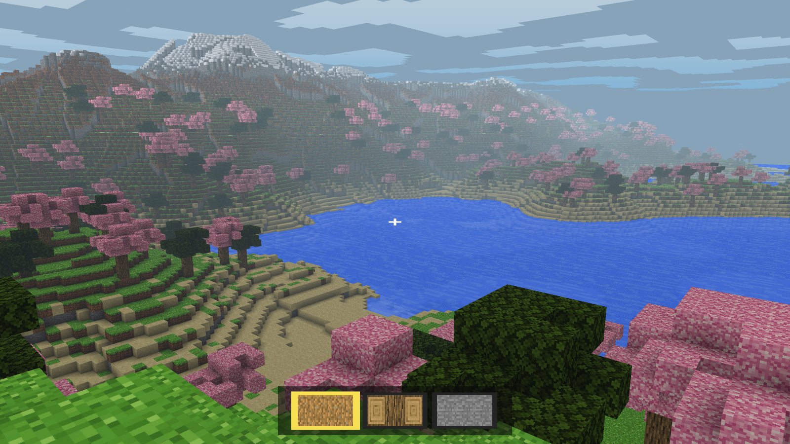

# 🌍 Craft - Procedural Voxel Engine

A custom-built **procedural voxel engine** developed in Python featuring terrain generation, multiple biomes, caves, physics, water simulation, block interaction, and a dynamic day-night cycle.

---

## ✨ Features

### 🌱 Procedural Terrain Generation
- Voxel terrain generation
- Noise-based world creation
- Smooth terrain variation

### 🌎 Multiple Biomes
- Forests 🌲
- Deserts 🏜️
- Snow Biomes ❄️
- Plains 🌿

### 🌳 Nature Generation
- Procedurally generated trees
- Natural terrain decoration
- Water bodies & lakes

### 🌊 Water Physics
- Dynamic water interaction
- Water bodies integrated into terrain
- Swimming mechanics

### ⛏️ Block Interaction
- Break blocks
- Place blocks
- Real-time terrain modification

### 🧍 Player Physics
- Gravity
- Collision detection
- Smooth movement system

### 🌙 Day & Night Cycle
- Dynamic lighting transitions
- Real-time sky changes
- Atmospheric environment

### 🕳️ Cave Generation
- Procedurally generated cave systems
- Underground exploration

---

## 🛠️ Tech Stack

- **Python**
- **OpenGL**
- **Pygame**
- **Procedural Noise Algorithms**

---

## 🎮 Controls

| Key           | Action      |
| ------------- | ----------- |
| `W A S D`     | Move        |
| `Space`       | Jump        |
| `Mouse`       | Look Around |
| `Left Shift`  | Sprint      |
| `Left Alt`    | Go deeper in water|
| `Left Click`  | Break/Place Block |
| `Right Click` | Change block interaction |

---

## 🎯 Goal of the Project

This project was created for learning and experimentation in:

- **Procedural terrain generation**
- **Voxel world and environment design**
- **Shader-based lighting and rendering**
- **HUD and block interaction systems**
- **Audio feedback and movement effects**

---

## 🔍 Preview

Here's a preview of the engine: 



---

## 💡 Inspiration

Inspired by sandbox voxel games like:

```
Minecraft
Minetest
Terraria
```

while exploring custom procedural generation and voxel engine mechanics from scratch.

---

## 📚 References & Resources

### Video References

- https://www.youtube.com/watch?v=Ab8TOSFfNp4  *(Voxel Engine Tutorial Series)*

- https://www.youtube.com/watch?v=M3iI2l0ltbE  *(Perlin Noise Explained)*

- https://www.youtube.com/watch?v=CSa5O6knuwI  *(OpenGL Voxel Rendering Concepts)*

- https://www.youtube.com/watch?v=8ptH79R53c0  *(Chunk Generation & Optimization)*

### Documentation & Learning Resources

- https://www.opengl.org/documentation/  *(Official OpenGL Documentation)*

- https://pyopengl.sourceforge.net/documentation/  *(PyOpenGL Documentation)*

- https://www.pygame.org/docs/  *(Pygame Documentation)*

- https://learnopengl.com/  *(Learn OpenGL - Graphics Programming Guide)*

- https://docs.python.org/3/  *(Official Python Documentation)*

- https://ephtracy.github.io/  *(MagicaVoxel Official Website)*

<br>

👨‍💻 **Developed by** - @Arijit2175